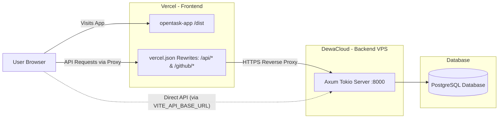

# OpenTask

**OpenTask** is a neo-brutalist project management and task tracking platform featuring real-time AI code reviews, GitHub App integration, meeting intelligence, and push notifications.

Built with a high-performance **Rust (Axum + Tokio)** backend and a reactive **React 19 (TypeScript + Vite)** frontend.

---

## Key Features

- **Neo-Brutalist UI**: High-contrast geometric interface, solid black borders, offset hard shadows, monospace accents, with full **Dark & Light** mode support.
- **Interactive Kanban & Timeline**: Dynamic drag-and-drop buckets, task reordering, priority weighting, and real-time progress indicators.
- **GitHub App & Automated AI PR Reviews**: Direct integration with GitHub organizations/repositories. Automatically evaluates pull requests using Google Gemini AI.
- **Meeting Intelligence**: Upload audio/transcripts or invite meeting bots to automatically generate Minutes of Meeting (MoM) and extract actionable tasks.
- **Stagnation Radar**: Automated background worker monitoring stale tasks and triggering alert notifications.
- **Multi-Channel Alerts**: Browser Web Push notifications (VAPID) and Telegram bot integration.
- **Safe 64-bit Snowflake IDs**: Twitter-style 64-bit BigInt primary keys with frontend precision-loss protection (`SafeId` serialization).

---

## Architecture Overview

```
OpenTask/
├── opentask-app/          # Frontend SPA (React 19, TypeScript, Vite, Tailwind CSS v4, Bun)
├── opentask-api/          # Primary Backend API (Rust, Axum, Tokio, SQLx, PostgreSQL)
├── api/                   # Legacy Backend API (Python, FastAPI, Uvicorn, UV)
├── .github/workflows/     # CI/CD pipelines (Docker build & DewaCloud SSH deployment)
├── vercel.json            # Vercel deployment configuration & reverse-proxy rewrites
└── docker-compose.yml     # Local database and infrastructure orchestration
```

---

## Toolchains & Tech Stack

| Component | Technology | Package Manager / Tooling |
| :--- | :--- | :--- |
| **Frontend** | React 19, TypeScript, Vite 8, Tailwind CSS v4 | **Bun** (`bun install`, `bun run dev`, `bun run build`) |
| **Rust API** | Rust 2024 Edition, Axum 0.8, Tokio, SQLx | **Cargo** (`cargo check`, `cargo build --release`) |
| **Python API** | Python 3.11+, FastAPI, Uvicorn, psycopg2 | **UV** (`uv sync`, `uv run uvicorn`) |
| **Database** | PostgreSQL 15+ (Supabase / Local) | SQLx Migrations / PostgreSQL connection pool |
| **Deployment** | Vercel (Frontend) + DewaCloud (Backend) | GitHub Actions, GHCR, Docker |

---

## Getting Started (Local Development)

### 1. Prerequisites
- [Bun](https://bun.sh/) (for frontend)
- [Rust & Cargo](https://rustup.rs/) (for primary Rust backend)
- [Docker & Docker Compose](https://www.docker.com/) (optional, for local DB)

### 2. Environment Setup
Copy the sample environment file:
```bash
cp .env.example .env
```
Fill in your configuration in `.env` (PostgreSQL connection, GitHub App credentials, Gemini API key, etc.).

### 3. Running the Rust API
```bash
cd opentask-api
cargo run
```
The server will start at `http://localhost:8000`. Health check: `http://localhost:8000/health`.

### 4. Running the Frontend
```bash
cd opentask-app
bun install
bun run dev
```
The frontend will launch at `http://localhost:5173` and automatically proxy API requests to `http://localhost:8000`.

---

## Deployment Architecture



OpenTask uses a decoupled production deployment:
1. **Frontend on Vercel**: Hosted as a high-speed static Vite build.
2. **Backend on DewaCloud**: Hosted in a lightweight Docker container running the compiled Rust binary.
3. **Database on Supabase**: Hosted PostgreSQL database.

---

## Deployment Setup Guide

### 1. Backend Deployment (DewaCloud + GHCR)

The Rust API is continuously built and deployed via GitHub Actions ([`.github/workflows/ci.yml`](file:///.github/workflows/ci.yml)).

#### CI/CD Pipeline Steps:
1. Triggers on push to `master` branch when files in `opentask-api/**` or `.github/workflows/ci.yml` change.
2. Builds an optimized multi-stage Docker image from `opentask-api/Dockerfile`.
3. Pushes the image to GitHub Container Registry (`ghcr.io/offside-software/opentask-rust-api:latest`).
4. SSHs into DewaCloud via SSH Gateway (`port: 3022`), pulls the image, and restarts the container:
   ```bash
   docker run -d --name rust-api --restart unless-stopped -p 80:8000 --env-file ~/OpenTask/.env \
     ghcr.io/offside-software/opentask-rust-api:latest
   ```

#### Required GitHub Secrets & Variables:
Go to **Settings** $\rightarrow$ **Secrets and variables** $\rightarrow$ **Actions**:

| Variable / Secret | Type | Description |
| :--- | :--- | :--- |
| `DEWACLOUD_SSH_HOST` | Variable / Secret | DewaCloud SSH Gateway host (e.g. `gate.dewacloud.com` or your region's gateway) |
| `DEWACLOUD_SSH_PORT` | Variable / Secret | DewaCloud SSH port (default: `3022`) |
| `DEWACLOUD_SSH_USER` | Variable / Secret | DewaCloud SSH username (from DewaCloud **SSH Access** menu) |
| `DEWACLOUD_SSH_PRIVATE_KEY` | Secret | Your private SSH key (public key registered in DewaCloud **SSH Keychain**) |
| `GHCR_PAT` | Secret | GitHub Personal Access Token with `read:packages` permission |

---

### 2. Frontend Deployment (Vercel)

The frontend is deployed to Vercel and configured via [`vercel.json`](file:///vercel.json).

#### Default Behavior (Seamless Proxying):
`vercel.json` proxies all requests starting with `/api` and `/github` directly to the DewaCloud Rust backend:
```json
{
  "version": 2,
  "buildCommand": "cd opentask-app && bun install && bun run build",
  "outputDirectory": "opentask-app/dist",
  "rewrites": [
    {
      "source": "/api/(.*)",
      "destination": "https://env-opentask.user.cloudjkt02.com/api/$1"
    },
    {
      "source": "/github/(.*)",
      "destination": "https://env-opentask.user.cloudjkt02.com/github/$1"
    },
    {
      "source": "/(.*)",
      "destination": "/index.html"
    }
  ]
}
```

#### Custom API Endpoints:
To point your Vercel deployment to a different API endpoint (e.g. staging or another server):
1. Open your project on the **Vercel Dashboard**.
2. Go to **Settings** $\rightarrow$ **Environment Variables**.
3. Add `VITE_API_BASE_URL` (e.g. `https://your-custom-api.com`).
4. Redeploy. The client bundle will automatically direct API requests to the specified endpoint.

#### Runtime Override (DevTools):
For instant testing without redeploying, you can override the API endpoint directly in browser console:
```javascript
localStorage.setItem('opentask_api_url', 'https://your-custom-api.com');
location.reload();
```

---

## GitHub OAuth & Cross-Origin Auth Flow

OpenTask handles OAuth smoothly across localhost, Vercel, and DewaCloud:

1. When logging in, the frontend passes `?return_to=<origin>` to the backend `/auth/login`.
2. The Rust backend preserves this return URL inside the OAuth `state` parameter (`{rand_id}.{hex_encoded_url}`).
3. After GitHub authorizes the request, the backend extracts the origin from `state` and redirects the user back to their original domain (`http://localhost:5173` or `https://*.vercel.app`) with `?token=<access_token>`.
4. The frontend stores the token in `localStorage`, cleans the URL parameter, and attaches `Authorization: Bearer <token>` to all subsequent requests.
5. In same-origin production environments, the HTTP-only `gh_token` cookie is also used automatically.

---

## License

This project is licensed under the MIT License.
